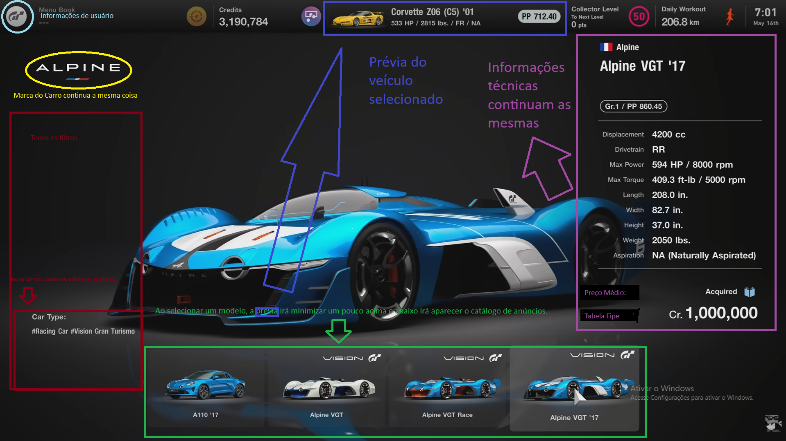

Somente idéias:
A intenção do projeto é substituir todo o mercado de compra e vendas de veículos automotivos, facilitando a busca para todos os usuários ao redor do mundo.
O principal diferencial será o sistema de busca do sistema. O sistema de busca será separado 
Usuários tem limitação de 1 anuncio gratuito por CPF de cadastro ou documento equivalente. Após o primeiro anuncio, o usuário deverá pagar uma taxa referente à locação do 
veículo no nosso Banco de Dados.
Criar 3 modos de busca em catálogo: Primeiro por região de marca (Europa, ásia...), Segundo por Tipo de Veículo (Marítimo, aéreo ou terrestre), Terceiro por categoria (Carro, moto...)
Um dos catálogos irá seguir o Padrão: Tipo de Veículo -> Categoria (Pode ser mais de uma e pode ser via Filtro), Marca (Pode ser mais de uma e pode ser via Filtro) 
Catálogo no estilo Grand Turismo - Separar por Região -> Marca -> Prévia de modelo = Ao selecionar o modelo, abaixo apresenta os anuncios. Na parte de cima do jogo
Gran Turismo, está as informações de usuário. Podemos deixar as informações de usuário somente no canto superior direito e no cabeçalho os filtros para auxílio ao usuário.
Restante podemos manter exatamente da mesma forma (Com as informações técnicas a direita, marca à esqueda), o problema do mercado atual é não chamar a atenção do usuário da mesma forma que um jogo faz.
